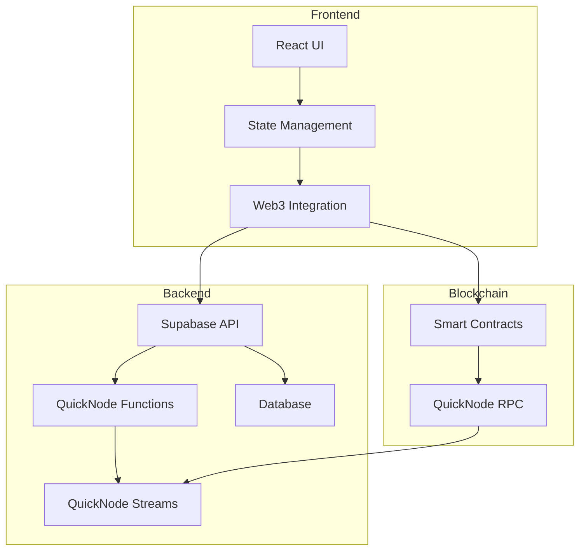

# 🚗 Decentralized Ride Sharing Platform

A full-stack decentralized ride-sharing application built with Ethereum smart contracts, QuickNode infrastructure, and modern web technologies.

## 📋 Table of Contents

- [Overview](#overview)
- [Architecture](#architecture)
- [Tech Stack](#tech-stack)
- [Features](#features)
- [Prerequisites](#prerequisites)
- [Installation](#installation)
- [QuickNode Setup](#quicknode-setup)
- [Frontend Setup](#frontend-setup)
- [License](#license)

## 🌟 Overview

This project implements a complete decentralized ride-sharing platform using Ethereum smart contracts for payment escrow, QuickNode for blockchain infrastructure, and a modern web stack for the user interface.

## 🏗 Architecture



## 💻 Tech Stack

### Blockchain & Web3
- Ethereum Smart Contracts (Solidity)
- QuickNode RPC, Streams & Functions
- Hardhat Development Environment
- Wagmi for Web3 interactions

### Backend
- Supabase
- PostgreSQL Database
- QuickNode Add-ons
- JWT Authentication

### Frontend
- React.js
- Redux Toolkit
- TailwindCSS
- Wallet Connect
- Quicknode

## ✨ Features

### Smart Contract Features
- Secure escrow system for ride payments
- Factory pattern for multiple escrow instances
- Platform fee integration
- Role-based access control

### QuickNode Integration
- **Streams**
  - Real-time ride status updates
  - Payment confirmation notifications
  - Driver location tracking
  
- **Functions**
  - Automated ride matching
  - Price calculation
  - Rating system
  
- **Add-ons**
  - Token balances tracking
  - NFT integration for loyalty programs
  - Transaction monitoring

### Application Features
- User authentication & profiles
- Real-time ride tracking
- In-app wallet integration
- Rating & review system

## 📝 Prerequisites

- Node.js >= 16.0.0
- PostgreSQL >= 14
- QuickNode Account
- MetaMask or Web3 Wallet
- Yarn or npm

## 🛠 Installation

1. Clone the repository:
```bash
git clone https://github.com/yourusername/ride-sharing-dapp.git
cd ride-sharing-dapp
```

2. Install root dependencies:
```bash
yarn install
```

3. Install workspace dependencies:
```bash
yarn workspaces run install
```

## ⚡ QuickNode Setup

### 1. RPC Endpoint Setup

```javascript
// config/quicknode.js
const QUICKNODE_RPC_URL = process.env.QUICKNODE_RPC_URL;
const provider = new ethers.providers.JsonRpcProvider(QUICKNODE_RPC_URL);
```

### 2. Streams Configuration

```javascript
// services/streams.js
const initializeStreams = async () => {
  const stream = new QuickNode.Stream({
    networkType: 'ethereum',
    projectId: process.env.QUICKNODE_PROJECT_ID,
    streamName: 'ride-events'
  });

  stream.addAddress({
    address: FACTORY_CONTRACT_ADDRESS,
    events: ['RideCreated', 'RideCompleted']
  });
};
```

### 3. Functions Implementation

```javascript
// functions/rideMatcher.js
export async function matchRide(ride) {
  const drivers = await getNearbyDrivers(ride.location);
  return optimizeMatch(drivers, ride);
}
```

## 🎨 Frontend Setup

1. Configure environment:
```env
REACT_APP_API_URL=http://localhost:3001
REACT_APP_QUICKNODE_RPC_URL=your_quicknode_rpc_url
```

2. Start the development server:
```bash
yarn workspace frontend dev
```

## 🔐 Security

- Smart contract security measures
- Rate limiting on API endpoints
- JWT authentication
- Input validation
- Data encryption
- WebSocket security

## 📄 License

This project is licensed under the MIT License - see the [LICENSE](LICENSE) file for details.

---

Built with ❤️ by Abbas Bhanpura wala
