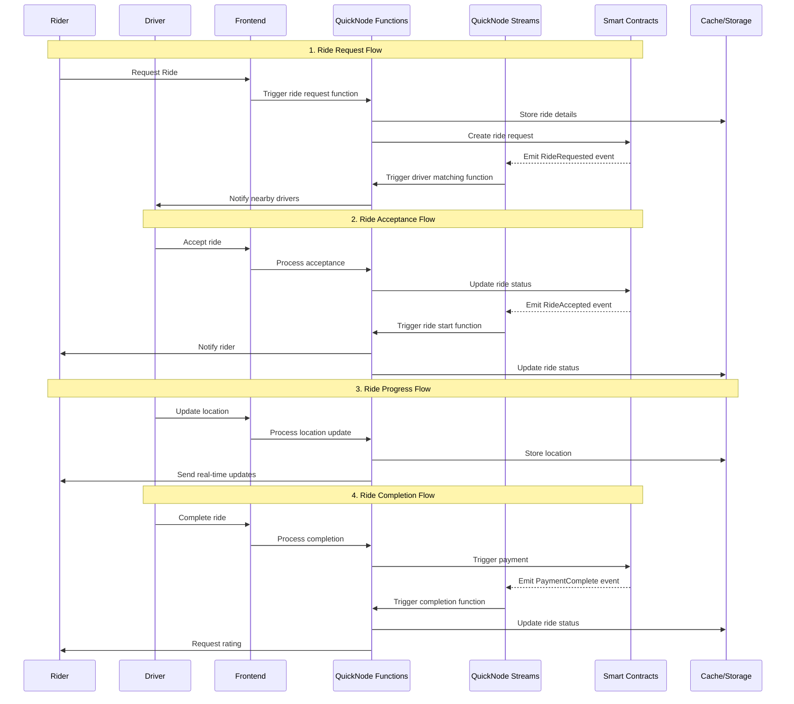

# 🚗 Decentralized Ride Sharing Platform

A decentralized ride-sharing platform that connects riders and drivers without the need for a middleman. Built during the BuildOn Hackathon by QuickNode to revolutionize transportation by utilizing blockchain for secure and trustless payments.


## 📋 Table of Contents

- [Features](#features)
- [Architecture](#architecture)
- [Tech Stack](#tech-stack)
- [Features](#features)
- [Prerequisites](#prerequisites)
- [Installation](#installation)
- [Challenges](#challenges)
- [License](#license)

## 🌟 Features

- **Decentralized Payment**: Payments are processed securely via smart contracts.
- **Driver and Rider Matching**: Efficient matching system to connect drivers and riders.
- **Fare Calculation**: Automatic fare calculation based on distance.
- **Hybrid Model**: Combines decentralized technology with a centralized UX for best performance.

## 🏗 Architecture



## 💻 Tech Stack

### Blockchain & Web3
- Ethereum Smart Contracts (Solidity)
- QuickNode RPC, Streams & Functions
- Hardhat Development Environment
- Wagmi for Web3 interactions

### Backend
- Supabase
- PostgreSQL Database
- QuickNode Add-ons
- JWT Authentication

### Frontend
- React.js
- Redux Toolkit
- TailwindCSS
- Wallet Connect
- Quicknode

## ✨ Features

### Smart Contract Features
- Secure escrow system for ride payments
- Platform fee integration
- Role-based access control

### QuickNode Integration
- **Streams**
  - Real-time ride status updates
  - Payment confirmation notifications
  - Driver location tracking
  
- **Functions**
  - Automated ride matching
  - Price calculation
  - Rating system
  
- **Add-ons**
  - Token balances tracking
  - NFT integration for loyalty programs
  - Transaction monitoring

### Application Features
- User authentication & profiles
- Real-time ride tracking
- In-app wallet integration
- Rating & review system

## 📝 Prerequisites

- Node.js >= 16.0.0
- PostgreSQL >= 14
- QuickNode Account
- MetaMask or Web3 Wallet
- Yarn or npm

## 📖 Challenges
- Integrating QuickNode's Streams and Functions for real-time data was challenging.
- Designing a seamless UX while maintaining decentralized principles required a hybrid model.

## 🛠 Installation

1. Clone the repository:
```bash
git clone https://github.com/yourusername/ride-sharing-dapp.git
cd ride-sharing-dapp
```

2. Install root dependencies:
```bash
yarn install
```

3. Install workspace dependencies:
```bash
yarn workspaces run install
```

## 📄 License

This project is licensed under the MIT License - see the [LICENSE](LICENSE) file for details.

---

Built with ❤️ by Abbas Bhanpura wala
